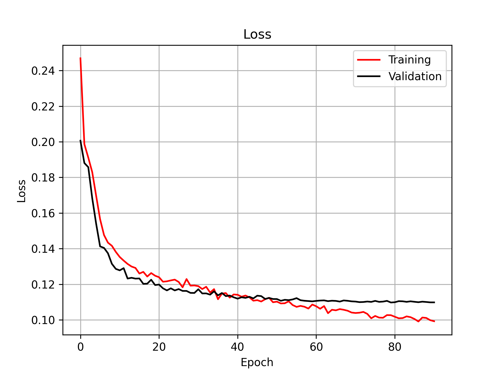
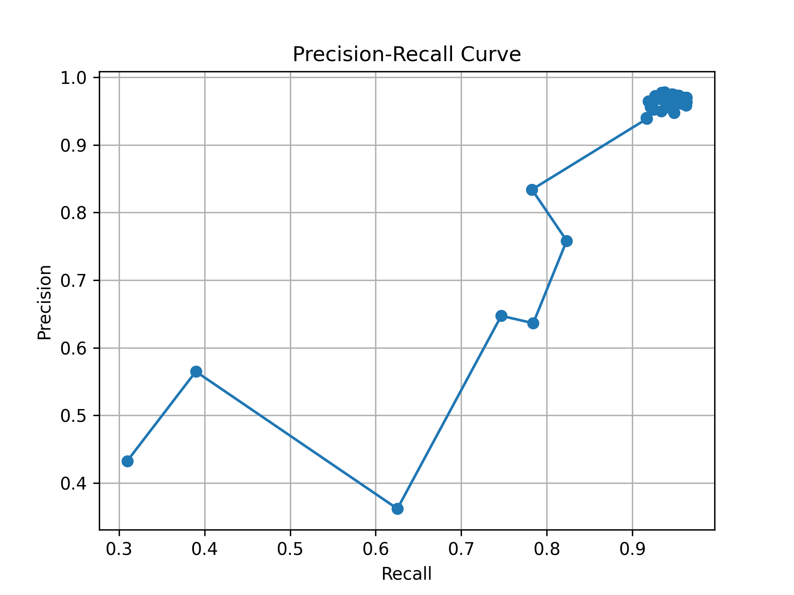

# NBA Detection

## What This Is

NBA Detection is a computer-vision pipeline for turning basketball footage into a top-down tactical view. The repo combines player detection, court registration, homography, and trajectory rendering to project broadcast footage onto a bird's-eye court representation.

## What Works

- Load basketball footage and court assets
- Detect players from video frames
- Estimate court geometry and camera alignment
- Warp detections into a top-down board view
- Render original, homography, and board-style outputs
- Generate training-analysis plots from YOLO training results

## How It's Built

- Main pipeline entry in [bird_eye_video.py](./bird_eye_video.py)
- Court-model code in [model_resnet.py](./model_resnet.py) and [modeling](./modeling)
- Data/transforms utilities under [data](./data)
- Vendored YOLOv5 source under [yolov5](./yolov5)
- Training-metric plotting in [yolo_result_analysis.py](./yolo_result_analysis.py)

## Technical Notes

- The public repo is intentionally curated around source code and lightweight assets. Large training sets, checkpoints, local videos, and generated outputs were removed so the repo stays reviewable.
- `yolov5` is vendored because the pipeline imports it directly rather than treating detection as an external service.
- The codebase now avoids machine-specific absolute import paths so the public snapshot is portable.

## Proof of Work

- Training curves: 
- Precision/recall curve: 
- Main pipeline code in [bird_eye_video.py](./bird_eye_video.py)

## Run Locally

Install the Python dependencies, add your own model weights and input footage, and then run:

```bash
python bird_eye_video.py
```
